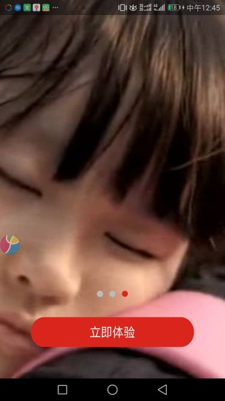

# lifecat-android
 

 
:cat: :smiley_cat: :kissing_cat:
 
> 这是lifecat项目的Android端手机应用，具有清晰的页面布局与简易的操作，引入了几个开源库，主要参照《第一行代码Android》此书进行编码
 
## 项目部署
### 本地部署
 ``` bash
 # Clone下载项目到本地
 git clone https://github.com/kevinten10/Android-lifecat
 
 # 启动运行
 ```
 
 ### 应用部署
 ```bash
 # 下载apk 在Android中安装
 ```
 
 账号admin@gmail.com 密码123456
 
 ### 主要界面
   * 欢迎界面：播放欢迎视频。
   * 登录/注册：用户登录/注册的操作均会连接到数据库，进行同数据库的操作
   * 主页面：跳转到其他页面，以及侧边栏显示用户信息
   * 上传图片：取得用户权限后，可以读取本机内的图片库或使用摄像头进行拍照，最多选中9张照片进行上传。
   * 相册：展示用户的图片库，基于卡片式布局，有效的进行界面的美观和管理
 
 ### 主要功能：
   * 服务器通信：使用Http协议进行数据传输，通过开源库OkHttp进行实现，能够向服务器发送POST请求，服务器使用java部署，能够通过jdbc获取数据库信息并返回响应，从而实现图片的上传存储与下载功能。
   * 图片展示：使用卡片式布局，实现良好的界面展示设计，实现Android图片显示功能。
   * 用户信息安全验证：通过与数据库的交互，实现用户的登录与注册，确保用户信息的安全性
   * 登录/注册：通过OkHttp发送POST请求到WEB服务器端，服务器端返回响应
   * 选择并上传图片：Album开源库
   * 电子宠物互动功能：语料库关键词匹配
   
 ## DEMO
  
  
  
  
  
    
 ### lifecat相关项目
   [v1 jsp+servlet+mysql实现Javaweb](https://github.com/kevinten10/lifecatweb)    
   [v2 ssm框架实现Javaweb后台管理系统](https://github.com/kevinten10/SSM-lifecat)  
   [v3 前后端分离之SpringBoot实现Java后端开发](https://github.com/kevinten10/springboot-lifecat)  
   [v3 前后端分离之vue实现后台管理系统](https://github.com/kevinten10/Vue-Admin-lifecat)  
   [v3 前后端分离之vue实现仿ins效果web开发](https://github.com/kevinten10/Web-lifecat)  
   
   [ex wechat 微信移动端小程序开发](https://github.com/kevinten10/WeChat-lifecat)  
   [ex hadoop 分布式平台进行数据处理](https://github.com/kevinten10/Hadoop-lifecat)  
   [ex android 相应Android相册应用](https://github.com/kevinten10/Android-lifecat)  
   [ex python 机器学习进行图像智能处理](https://github.com/kevinten10/Python-lifecat)  
    
### LifeCat系列总览
  [LifeCat系列项目](https://github.com/kevinten10/LifeCat)  
  
  如果觉得有用，可以帮忙点个star，谢谢啦！
   
